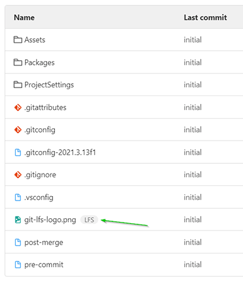

# Unity Quickstart (with GIT/LFS)

## Add to existing GIT (non-lfs) project

- See: https://github.com/rboonzaijer/unity-git-migrate-to-lfs

## Add to existing non-git project

```bash
curl -O https://raw.githubusercontent.com/rboonzaijer/unity-quickstart/main/all-unity-root-files/.gitattributes
curl -O https://raw.githubusercontent.com/rboonzaijer/unity-quickstart/main/all-unity-root-files/.gitconfig
curl -O https://raw.githubusercontent.com/rboonzaijer/unity-quickstart/main/all-unity-root-files/.gitconfig---2021.3.13f1
curl -O https://raw.githubusercontent.com/rboonzaijer/unity-quickstart/main/all-unity-root-files/.gitconfig-update-version.bat
curl -O https://raw.githubusercontent.com/rboonzaijer/unity-quickstart/main/all-unity-root-files/.gitignore
curl -O https://raw.githubusercontent.com/rboonzaijer/unity-quickstart/main/all-unity-root-files/readme.md
curl -O -L https://raw.githubusercontent.com/rboonzaijer/unity-quickstart/main/all-unity-root-files/git-lfs-logo.png
curl -L -A "Mozilla/5.0 (Windows NT 10.0; Win64; x64; rv:137.0) Gecko/20100101 Firefox/137.0" -O https://media.githubusercontent.com/media/rboonzaijer/unity-quickstart/refs/heads/main/all-unity-root-files/git-lfs-logo.png
```

- Open current folder in Explorer:

```bash
explorer .
```

- Doubleclick on '.gitconfig-update-version.bat' to automatically read + update the version in .gitconfig

```bash
git init
git lfs install
git add .
curl -o .git/hooks/pre-commit https://raw.githubusercontent.com/rboonzaijer/unity-quickstart/main/all-unity-root-files/pre-commit
git commit -m "initial"
```

```bash
git remote add origin ssh://git@{host}:{port}/{new-repo}.git
git push -u origin main
```

# HOWTO use existing Unity project (with GIT/LFS)

- `git clone {repository-url}`

  ( lfs will already be enabled if it's enabled in the repository )

## Setup client
- Install git: https://git-scm.com
- Install git-lfs: https://git-lfs.github.com
- Setup SSH keys: https://docs.gitlab.com/ee/user/ssh.html#generate-an-ssh-key-pair

## (optional) Setup private Gitlab server
https://github.com/rboonzaijer/gitlab-docker


## Project setup

- Unity Hub > New project > {type=`3D`, Project Name=`"My New Project"`, Location=`C:\git`} > Create project

- Edit > Project Settings:
    - [Category: Editor] Asset Serialization / Mode: “Force Text”
    - [Category: Version Control ] Mode: “Visible Meta Files”

- File > Save Project

## Git setup
- Copy ***all files*** from the directory `all-unity-root-files` to the **root** of the project (+ optionally the https://github.com/rboonzaijer/unity-quickstart/raw/main/git-lfs-logo.png to directly test if it works)

  (TIP: Download this repo as zip: https://github.com/rboonzaijer/unity-quickstart/archive/refs/heads/master.zip)

- Run (doubleclick): .gitconfig-update-version.bat (Every time you update your Unity version)
  The version will be updated in these files: `.gitconfig` &  `.gitconfig---2021.3.13f1`


- `cd "git\My New Project"`
- `git init`
- `git lfs install`
- `git add .`
- `git commit -m "initial"`
- Create new empty project in Gitlab (or other git place...)
- `git remote add origin {repository-url}`
- `git push -u origin main`

  


# More info

- https://github.com/NYUGameCenter/Unity-Git-Config
- https://www.gamedeveloper.com/programming/the-complete-guide-to-unity-git
