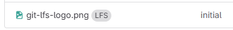

# Unity Quickstart (with GIT/LFS)

## Step 1. Create new Unity Project

- Edit > Project Settings:
    - [Category: Editor] Asset Serialization / Mode: “Force Text”
    - [Category: Version Control ] Mode: “Visible Meta Files”

- File > Save Project

## Step 2. Download files

Note, png file requires a [user agent](https://www.whatismybrowser.com/guides/the-latest-user-agent/firefox) to download (used 'Firefox on Linux')

- Open command prompt (Win+R -> 'cmd')
- Copy the following commands and paste/execute them all at once

```bash
git init --initial-branch=main
git lfs install
curl https://raw.githubusercontent.com/rboonzaijer/unity-quickstart/main/Project/-%20Git%20lfs%20check/pre-commit -o ".git/hooks/pre-commit"

curl -L -A "Mozilla/5.0 (X11; Linux i686; rv:140.0) Gecko/20100101 Firefox/140.0" -O https://media.githubusercontent.com/media/rboonzaijer/unity-quickstart/main/Project/git-lfs-logo.png

curl https://raw.githubusercontent.com/rboonzaijer/unity-quickstart/main/Project/{.gitattributes,.gitignore} -O

curl https://raw.githubusercontent.com/rboonzaijer/unity-quickstart/main/Project/-%20Git%20lfs%20check/{README.md,pre-commit,pre-commit-install.ps1} -o "- Git lfs check\#1" --create-dirs

curl https://raw.githubusercontent.com/rboonzaijer/unity-quickstart/main/Project/Assets/Editor/{UnityEditorMenuSaveAll.cs,UnityPostBuildCallbacks.cs} -o "Assets\Editor\#1" --create-dirs

curl https://raw.githubusercontent.com/rboonzaijer/unity-quickstart/main/Project/-%20Build%20Scripts/Build{-WindowsDefault,WindowsLZ4,WindowsLZ4HC,Config,Profile}.ps1 -o "- Build Scripts/Build#1.ps1" --create-dirs

curl https://raw.githubusercontent.com/rboonzaijer/unity-quickstart/main/Project/{.gitconfig,.gitconfig-update-version.bat} -O
curl https://raw.githubusercontent.com/rboonzaijer/unity-quickstart/main/Project/.gitconfig---%5Brun%20update-version.bat%5D -o ".gitconfig---[run update-version.bat]"
.gitconfig-update-version.bat

```

## Step 3. Open project in Unity, Save + Save Project

- Go into Unity again, and press **CTRL+SHIFT+ALT+S** (Or: **File > Save All**)

## Step 4. Initial commit

```bash
git add .
git commit -m "initial"
```

```bash
# Optionally, see which files are tracked with LFS (can be done before the commit)
git lfs ls-files
```

## Step 5. Push to remote

```bash
git remote add origin ssh://git@{host}:{port}/{new-repo}.git
git push -u origin main
```

You can check in your repository if the png is stored with lfs.

- Gitlab:
  
- Github:
  

# HOWTO use existing Unity project (with GIT/LFS)

- `git clone {repository-url}` (lfs will already be enabled if it's enabled in the repository)
- Navigate to `Project/- Git lfs check/pre-commit-install.ps1` Rightclick > Run with PowerShell

# Move to another repository (from github to gitlab for example)

- You have to make sure your local files are the 'real' files, and not LFS pointers

```bash
git lfs install
git lfs fetch --all
```

# More info

- https://github.com/NYUGameCenter/Unity-Git-Config
- https://www.gamedeveloper.com/programming/the-complete-guide-to-unity-git
